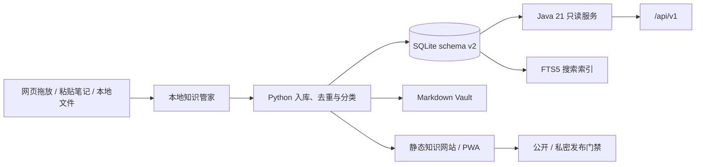

# Personal Knowledge OS

[](https://github.com/Eascaty/open-knowledge/actions/workflows/ci.yml)
[](https://github.com/Eascaty/open-knowledge/releases/latest)
[](LICENSE)
[](pyproject.toml)
[](apps/api/pom.xml)
[](apps/api/pom.xml)
[](https://eascaty.github.io/open-knowledge/)

把散落在电脑里的 Markdown、文本、代码、HTML、DOCX 和 PDF，离线整理成一个可搜索、可追溯、可浏览的个人知识库。

**本地优先 · 默认私密 · 零付费 API · Python 流水线 + Java 只读 API/离线导入 CLI**


## 在线体验

访问 **[GitHub Pages 公开 Demo](https://eascaty.github.io/open-knowledge/)**，无需安装即可体验分类树、全文搜索、知识详情和关系地图。

在线 Demo 只使用仓库中三份虚构测试资料，由 GitHub Actions 在隔离临时目录重新构建，并在隐私、密钥、断链、数据库和 public 可见性门禁全部通过后发布。它不会读取或上传维护者本机的真实 `workspace/`、SQLite、Vault 或私密网站。

## 这个项目能做什么

如果你的学习笔记、技术文档和资料长期散落在不同文件夹里，这个项目可以帮助你完成下面这条流水线：

```text
把文件放入 workspace/inbox/
        ↓
扫描、解析和 SHA-256 去重
        ↓
提炼摘要、标签和关键点
        ↓
归入严格的专业母子分类树
        ↓
写入 SQLite + 生成 Markdown Vault
        ↓
构建全文搜索、关系图和静态知识网站
        ↓
执行隐私、密钥、断链和数据库健康检查
```

你最终会得到：

| 产物 | 用途 |
|---|---|
| SQLite 知识库 | 保存来源、任务、分类、知识条目和关系 |
| Markdown Vault | 使用编辑器直接阅读或长期归档 |
| 本地静态网站 | 浏览分类树、搜索知识、查看关系地图 |
| Java 21 API | 以版本化只读接口访问公开知识 |
| 健康检查报告 | 检查数据库、隐私、密钥和断链问题 |

整个 Python 核心流程可以离线运行，不调用付费模型 API，也不会上传你的原始资料。

## 适合谁

- 希望整理 Java、AI、金融或其他专业学习资料的开发者。
- 希望知识库掌握在自己电脑里，而不是被某个平台绑定的人。
- 想研究本地优先、知识处理流水线、SQLite、PWA 或 Spring Boot 的开发者。

它目前不是 Notion 的完整替代品，也不是多人协作 SaaS。项目优先保证单机隐私、数据可迁移和处理过程可审计。

## 三分钟体验

### 1. 准备环境

当前推荐环境：

- macOS（主要开发和本机验收环境）
- Python 3.9 或更高版本
- Git
- 浏览器

Python 流水线只使用标准库与系统 SQLite，不需要创建虚拟环境或安装 Python 依赖。

### 2. 克隆项目

```bash
git clone https://github.com/Eascaty/open-knowledge.git
cd open-knowledge
```

### 3. 准备一份资料

仓库内已经提供三份虚构测试资料。你可以先复制一份到收件箱：

```bash
mkdir -p workspace/inbox/files
cp tests/fixtures/java_g1.md workspace/inbox/files/
```

也可以直接把自己的文件复制到 `workspace/inbox/files/`。原文件不会被覆盖；系统会把不可变副本、标准化内容和知识条目分别保存。

### 4. 双击打开知识库

在 macOS Finder 中双击项目根目录的 `打开知识库.command`。它会在后台启动本地知识管家并自动打开浏览器，不需要 Docker，也不需要一直保留终端窗口。

如果更喜欢命令行，等价入口是：

```bash
./scripts/knowledge-manager start
```

第一次还没有网站时，浏览器会显示“知识库正在准备”，完成后自动刷新。知识管家会初始化目录和 SQLite，扫描收件箱，完成去重、解析、分类、知识生成、网站构建以及健康检查。

成功输出中应该看到：

```json
{
  "jobs_failed": 0,
  "gate_allowed": true,
  "health_status": "PASS",
  "network_requests": 0,
  "ok": true
}
```

### 5. 继续投入资料

知识管家运行期间，网页右上角会出现“投放资料”。可以拖入文件、点击选择，也可以展开“直接粘贴文字或 Markdown”，把聊天内容、临时笔记或思考直接交给知识管家。网页会显示接收和整理进度；完成后自动刷新并打开对应知识。也可以继续直接把文件放进 `workspace/inbox/files/`。

知识网站固定访问 [http://127.0.0.1:8765](http://127.0.0.1:8765)；重复双击只会复用同一个后台实例，不会越开越多。GitHub Pages 等公开静态 Demo 没有本地写入能力，因此不会显示投放入口。

## 日常怎么使用

最常见的使用方式只有两步：

1. 第一次或电脑重启后，双击 `打开知识库.command`。
2. 在网页右上角点击“投放资料”，拖入文件或直接粘贴文字，等待它自动打开。

关闭投放窗口不会中断处理，刷新网页后仍会恢复本次进度。后台处理失败时，上一版正常网站仍会继续提供；错误详情只写入 Git 忽略的私密日志。知识管家只监听本机 `127.0.0.1`，网页投放会话与停止服务的控制令牌相互隔离，两者都不会进入知识网站构建。

支持的输入包括：

- `.txt`、`.md` 和常见代码文件
- `.html`、`.htm`
- `.docx`
- `.pdf`：需要系统可用的 `pdftotext`，未安装时会给出明确提示

较长的 Markdown 会按二级标题拆成多张知识卡，每张卡独立提炼、分类和检索；原始文件保持不变。系统会在卡片中记录标题路径、原文行号、正文哈希和拆分器版本，便于网页、API 与未来 App 回到同一来源。

常用命令：

```bash
# 启动并打开网站；重复执行会复用现有实例
./scripts/knowledge-manager start

# 查看后台状态和最近一次处理结果
./scripts/knowledge-manager status

# 安全停止本项目匹配的后台实例
./scripts/knowledge-manager stop

# 手工立即跑一次完整流水线（排障或自动化脚本使用）
./scripts/run-pipeline

# 查看资料、任务和索引状态
./scripts/kb status

# 搜索本地知识
./scripts/kb query "G1"

# 直接导入一段文本
./scripts/kb ingest --text "今天学习了 G1 Mixed GC" --title "G1 学习记录"

# 执行数据库、隐私、密钥和断链检查
./scripts/doctor

# 创建 SQLite 一致性备份
./scripts/backup

# 用固定虚构资料执行批量、幂等、失败隔离验收
./scripts/acceptance

# 在临时候选库中验证某个快照，不覆盖正式数据库
./scripts/restore-drill /absolute/path/to/snapshot.sqlite3 --sha256 <digest>

# 运行 Python 测试
./scripts/test
```

重复投入同一个文件不会生成重复资料：系统使用 SHA-256 去重，处理任务也可以安全重试。

## 从 SQLite schema v1 升级

新项目直接创建 schema v2。只有已经使用过 v0.4.0 或更早版本、且本机存在 v1 数据库时，才需要执行一次：

```bash
./scripts/knowledge-manager stop
./scripts/migrate
./scripts/knowledge-manager start
```

迁移会先生成经过完整性验证的 SQLite 快照，再在单一事务中升级；失败会完整回滚。旧 Markdown 来源会重新排队，以便按标题生成知识卡。程序不会静默迁移数据库，真实切换和恢复步骤见 [`docs/runbooks/backup-restore.md`](docs/runbooks/backup-restore.md)。

## 数据保存在哪里

| 目录 | 内容 | 是否应上传 GitHub |
|---|---|---|
| `workspace/inbox/` | 等待处理的用户资料 | 否 |
| `workspace/data/raw/` | 不可变原始副本 | 否 |
| `workspace/data/normalized/` | 标准化文本 | 否 |
| `workspace/data/state/` | SQLite 数据库和运行状态 | 否 |
| `workspace/vault/` | 生成的 Markdown 知识页 | 默认否 |
| `workspace/site/dist/` | 私密本地网站 | 否 |
| `exports/public/` | 通过门禁的公开构建 | 可以 |

这些私密路径已经由 `.gitignore` 排除。新知识默认标记为 `private`；公开构建只接受明确标记为 `public` 的内容。

> 不要为了展示项目而提交自己的真实知识库。建议使用虚构样例制作公开演示。

## 系统架构



- **Python 主流水线**：拥有 schema、任务处理、分类、提炼、建站和运维检查；Java 可选 CLI 仅负责兼容的离线文件入队。
- **本地知识管家**：提供本机文件投放、粘贴笔记、逐条进度、单实例收件箱监听和全流水线编排，并持续提供上一版正常网站；只依赖 Python 标准库。
- **SQLite**：以 source 1:N knowledge cards 保存可审计状态，并提供 FTS5 搜索能力。
- **静态网站**：原生 HTML、CSS、JavaScript，无前端运行时依赖。
- **Java 只读 API**：只读取 Python 已生成的 SQLite，并结构性过滤 private 内容和本地绝对路径。
- **共享适配边界**：Web 可从静态包或 API v1 加载；未来 App 复用 OpenAPI，不直接读取 SQLite。

默认提炼器是确定性的本地规则，不产生网络请求。你也可以在 `config/runtime.json` 中选择本机 Ollama；Ollama 是可选项，不影响零依赖基础流程。

## Java 只读 API（可选）

如果只想整理和浏览知识，不需要启动 Java。Java 模块面向希望进行二次开发或通过 HTTP 读取公开知识的用户。

前置环境：Java 21。项目内 Maven Wrapper 会在首次运行时联网下载并校验固定版本的 Maven，然后下载开源依赖。

```bash
# 运行 Java 契约、接口、仓储测试和覆盖率门禁
./scripts/java-test

# 启动只读服务
./scripts/java-service

# 可选：使用 Java 将本地文件幂等入队，后续仍由 Python 流水线处理
./scripts/java-import /absolute/path/to/note.md
./scripts/run-pipeline
```

默认监听 `http://127.0.0.1:8080`：

| 接口 | 用途 |
|---|---|
| `GET /api/v1/health` | 数据库与 schema 健康状态 |
| `GET /api/v1/taxonomy` | 严格母子分类树 |
| `GET /api/v1/documents` | 公开知识分页列表 |
| `GET /api/v1/documents/{id}` | 公开知识详情、来源与关系 |
| `GET /api/v1/search?q=G1` | 公开知识搜索 |

数据库不在默认路径时，可以在启动前设置 `KNOWLEDGE_DB_PATH`。服务默认只绑定本机回环地址，不会自动暴露到局域网或公网。

### Docker 启动只读 API

先使用 `./scripts/backup` 生成并验证一致性 SQLite 快照，再把快照的绝对路径传给 Compose。容器不会接触原始资料、Vault 或 private 站点：

```bash
KNOWLEDGE_DB_FILE=/absolute/path/to/verified-snapshot.sqlite3 \
docker compose up --build -d

curl http://127.0.0.1:8080/actuator/health/liveness
curl http://127.0.0.1:8080/actuator/health/readiness
```

镜像使用固定 Temurin 21 补丁版本、多阶段构建和 UID 10001；Compose 默认只绑定 `127.0.0.1`，根文件系统与数据库挂载均只读，并移除全部 Linux capabilities。SQLite JDBC 只获准在一个16MB、UID 10001 专用的临时挂载中加载原生库，不获得其他写目录；数据库以 `mode=ro&immutable=1` 打开，因此必须使用 `./scripts/backup` 生成的已验证快照，不能直接挂载正在写入的实时数据库。Java 只读层兼容 schema v1/v2；其他版本或不可读数据库会使 readiness 失败。停止服务使用 `docker compose down`。

## 公开站点与隐私边界

本地私密网站：

```bash
./scripts/run-pipeline --visibility private
```

公开候选构建：

```bash
./scripts/run-pipeline --visibility public
```

公开构建写入 `exports/public/`，并再次执行隐私、密钥和链接门禁。由于所有新知识默认都是 private，没有显式公开资料时，公开站点为空是正常的安全行为。

项目预留了 Cloudflare Pages 适配器，但默认只生成部署计划，不会替你登录、创建收费资源或上传内容。

## 可验证版本发布

正式版本只从已经合入 `main` 的 `v<major>.<minor>.<patch>` tag 生成。发布工作流会重新运行 Python、Java、Web、公开 Demo 和容器构建，随后生成版本化 Java JAR、SHA-256 校验文件与 GitHub build provenance；任何 tag、Python、Java、运行时或 CHANGELOG 版本不一致都会直接拒绝发布。

发布前可在本地检查版本：

```bash
./scripts/verify-release v0.5.0
```

Release 产物不包含 `workspace/`、SQLite、原始资料、私密站点或凭据。

## 项目目录

```text
open-knowledge/
├── apps/
│   ├── pipeline/             # Python 主流水线与唯一任务处理方
│   ├── api/                  # Java 21 只读 API + 受限离线导入 CLI
│   └── web/                  # 静态网站与 PWA 源码
├── packages/contracts/       # Web、API 与未来 App 的共享契约
├── config/                   # taxonomy 与运行配置模板
├── workspace/                # 私密输入、SQLite、Vault 和私密构建
├── exports/public/           # 用户知识唯一公开候选
├── docs/                     # 设计、路线、测试和运行手册
├── ops/                      # launchd 等可选运维模板
├── scripts/                  # 稳定的一键入口
├── 打开知识库.command        # macOS 双击入口
└── tests/                    # 跨应用测试和虚构样例
```

## 当前质量状态

- Python：持续覆盖架构边界、共享契约、幂等、分类、隐私门禁、越界路径、网站构建和公开 Demo 隔离。
- Java：覆盖只读 API、全文搜索、受限离线导入、跨 Python/Java 项目锁与存活/就绪探针；JaCoCo 指令/分支覆盖率由 CI 门禁持续要求不低于80%/60%。
- Web：静态包/API v1 两种数据源适配器测试，并完成桌面与390×844手机浏览器验收。
- CI：Python 3.9、3.12、3.13、Java 21、Public Demo 与非 root 容器冒烟均为持续验证项。
- 安全：CodeQL、Dependabot、Secret Scanning、Push Protection 已启用。
- 发布：从 `main` tag 可复现生成 Spring Boot JAR、SHA-256 与 build provenance。

查看 [当前项目状态](STATUS.md)、[测试报告](docs/test-report.md)和 [GitHub 发布后审计](docs/repository-audit.md)。

## 常见问题

### 会把我的文件上传到网络吗？

默认不会。Python 基础流水线使用本地规则和 SQLite，运行结果会报告 `network_requests: 0`。只有你主动配置本地 Ollama之外的扩展或主动执行部署时，网络行为才可能发生。

### 一定要运行 Java 吗？

不用。Python 流水线和静态网站已经构成可独立运行的完整 MVP；Java 服务和离线导入 CLI 都是可选增强。

### 能直接把私密站点发布到公网吗？

不建议。应先把可公开内容单独标记为 public，通过发布门禁，再使用 Cloudflare Access 等身份保护。真实原始资料、数据库和 private 构建不得上传。

### 为什么同一个文件再次投入没有新增知识？

这是预期行为。系统按内容哈希去重，保证重复执行的幂等性。

### Windows 能运行吗？

核心 Python 代码是跨平台的，CI 也在 Linux 上验证；当前一键脚本主要按 macOS/zsh 编写。Windows 用户建议使用 WSL，原生 PowerShell 启动脚本仍属于后续工作。

## 路线图

- J2：中文全文搜索、安全高亮和性能基准已完成。
- J3：受限 Java 离线导入 CLI；兼容 schema v1/v2，通过跨运行时项目锁和单事务保证幂等，不开放 HTTP 写入。
- J4：非 root Docker/Compose、存活与数据库就绪探针、容器 CI 已完成；远程认证和同步留到真实部署需求明确后设计。
- 长 Markdown 拆卡、批量虚构验收和恢复演练已经完成；后续持续丰富公开 Demo 与交互验收。

详细计划见 [Java 演进路线](docs/java-roadmap.md)和 [J2 搜索基准](docs/benchmarks/java-search.md)。

## 参与贡献

请先阅读 [贡献指南](CONTRIBUTING.md)和 [安全策略](SECURITY.md)。提交前至少运行：

```bash
./scripts/test
./scripts/java-test
```

项目采用 [Apache License 2.0](LICENSE) 开源。安全问题请使用 GitHub 的[私密漏洞报告](https://github.com/Eascaty/open-knowledge/security/advisories/new)，不要创建公开 Issue。
