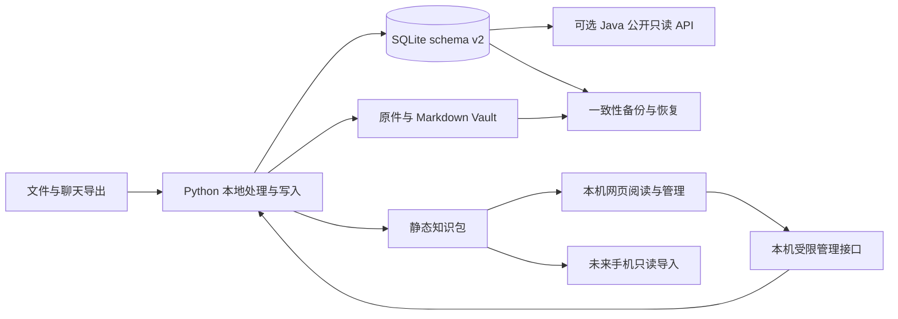

# Open Knowledge：本地优先产品、开源增长与商业化方案

日期：2026-09-08（Asia/Shanghai）  
性质：经维护者要求纳入仓库的产品路线与分析快照；技术现状以权威设计和 STATUS 为准。
公开整理：移除本机使用统计和私密报告链接；外部价格、规则与仓库数字保留原报告日期口径，本轮未重新核验。  
目标：先成为维护者经常使用的本地软件，再争取 GitHub 100 stars，验证需求后才投入跨平台和商店商业发行。  
成本约束：GitHub 阶段不购买服务器、域名、第三方 API 或付费 SaaS。使用已有电脑；开发时间、磁盘和电力仍属于实际资源成本。

## 1. 核心判断

项目已经具备可用的本地知识处理底座，接下来的主问题是把它变成用户能装好、愿意反复使用、数据能够完整带走的产品。

最值得保留的产品方向是：**把散乱的资料和 AI 对话，整理成能核对来源、能纠正归类、能持续复核、能快速找回的个人知识库。** “个人知识操作系统”可以保留为愿景，但首次展示应先讲清一个用户任务。

建议先聚焦中文技术学习与工作资料整理：导入一份长笔记或聊天导出，形成可读的卡片；找到一条工作需要的知识，核对原文后复制复用。多领域分类能力继续保留，首轮获客和样例聚焦一个群体。这是待验证的定位假设，并非已有用户研究结论。

当前最优先的顺序：

1. 收口已经写好的功能分支，完成检查、评审和版本交付。
2. 打通下载、安装、第一次成功导入与找回资料的体验。
3. 补齐完整备份后的新目录恢复、换机迁移和回退。
4. 完善搜索、来源定位和个人补充，验证自己是否持续使用。
5. 用小规模真实体验推动开源增长；以安装成功和回访验证产品，以 stars 衡量传播。
6. 先试手机只读资料包，再决定独立编辑和同步；最后才评估原生商店版本。

“本地做到极致”需要有完成标准，否则会演变成无限加功能。建议把第一轮标准定义为：**自己连续四周经常使用；陌生用户能独立安装并完成核心流程；导入和恢复不丢数据；一千张卡仍有可接受的打开与搜索速度。** 达标后才能判断新的能力是否必要。

## 2. 本次读取范围与证据可信度

### 2.1 已核验

- 项目规则、README、STATUS、CHANGELOG、权威设计、工作流、运行手册、历史审计、决策与运维记录。
- Python 导入、处理、存储、建站、本机 HTTP 和管理器；Web 阅读、搜索、归类、审核；Java API、契约、构建、发布与测试。
- 所有正式分支、远端跟踪分支和 tag 的可达 Git 日志，非合并提交的文件与增删分布，关键阶段差异。逐条审计材料保留在本机私密工作区。不声称逐行安全审计了每个历史版本。
- GitHub 当前仓库、主线、开放 Issues/PRs 和最新 Release；此前查询到主线 CI、Pages 发布成功。
- 本机数据库只读聚合统计；没有把原始笔记或聊天正文写入报告，也没有对真实知识执行试改、迁移或恢复。
- 项目相关任务的近期状态，避免把另一任务刚完成的功能再次列作从零开发。
- 竞品、GitHub 免费服务、PWA 和 Apple 规则的官方资料。外部规则主要于 2026-09-06 核验，仓库与版本数据于 2026-09-08 刷新；上架或付费时须重新核对规则。

### 2.2 不应夸大的结论

本次不是完整渗透测试、全量真实资料质量审计、跨系统兼容认证或市场调查。在线 Demo 的浏览器复查遇到加载超时；已有部署成功记录不等于本次完整在线交互验收通过。测试文档中的旧结果与本轮实际运行结果分别记录。

“所有待办”的范围是本项目文件、代码标记、GitHub 开放事项、本机处理队列及可见项目任务；不包含未向本任务提供的其他个人待办工具或私下计划。

## 3. 当前状态：必须区分三个版本层次

### 3.1 Git 与发布快照

| 项目 | 截至本次核验的状态 | 含义 |
|---|---|---|
| 公开仓库 | Eascaty/open-knowledge；0 stars、0 forks | 仍处于传播和需求验证的起点 |
| 正式主线 | `main = origin/main = 0a8e8c2` | 主线可用能力的审计基线 |
| 当前功能分支 | `codex/markdown-reader`，已提交基线 `cc51bf0` | 比 main 多 13 次提交，尚未合入 |
| 最新 Release | `v0.5.0`，tag 对应 `3e19b5b` | 与当前主线、分支功能不同 |
| 正式引用可达历史 | 112 次；main 95 次，功能分支新增 13 次，另有 4 条依赖更新提交 | 合并和修复不能重复算作独立功能 |
| 主线相对 v0.5.0 | 多 18 次提交 | 已合入也不代表已正式发布 |
| 功能分支相对 v0.5.0 | 多 31 次提交 | 面向用户发布已有明显积压 |
| 最新 Release 附件 | Java JAR 与 SHA-256 | 下载它不能获得完整 Python 本地产品 |
| 开放事项 | 0 个普通 Issue，4 个 Dependabot PR | 没有形成公开的产品待办队列 |
| 仓库展示 | 已有主题标签；Homepage 空白、Discussions 未启用 | 存在低成本展示改善空间 |

以上是实时仓库事实，不代表安装人数。Release JAR 下载数也不能用来推断本地产品用户数。[仓库](https://github.com/Eascaty/open-knowledge)、[当前 Release](https://github.com/Eascaty/open-knowledge/releases/tag/v0.5.0)、[开放 PR](https://github.com/Eascaty/open-knowledge/pulls)

初次 09-06 的 `git --all` 显示 100 条，包含一个失效 detached 工作树里的历史提交；后续还有工具内部快照引用。报告统一采用正式分支/tag 的 112 条口径，额外历史单列，不通过改写或删除历史“整理”数字。作者名称存在同一维护者的不同标识，不能按字符串数量声称有多个独立贡献者。

### 3.2 能力矩阵

| 能力 | 正式 v0.5.0 | main | `cc51bf0` 功能分支 | 当前实际边界 |
|---|---|---|---|---|
| 文件解析、哈希去重、严格分类、SQLite、Vault | 有 | 有 | 有 | 不是通用富文本编辑器 |
| 双击启动、后台监听、网页文件投放 | 有 | 有 | 有 | macOS 是主要使用环境 |
| 长 Markdown 拆卡与来源定位元数据 | 有 | 有 | 有 | 按规则拆分，不等于语义理解任意资料 |
| schema v2 迁移、数据库恢复演练 | 有 | 有 | 有 | 演练与覆盖正式库是不同操作 |
| 直接粘贴、可解释相关知识 | 无 | 有 | 有 | 推荐信号不等于事实证据 |
| 人工归类、撤销、可信状态、复核队列 | 无 | 有 | 有 | 本机管理面；公开站无写入口 |
| Markdown 排版、目录、正文下载 | 无 | 无 | 已实现 | 待整体交付验收 |
| 复制正文/链接、最近阅读 | 无 | 无 | 已实现 | 最近阅读最多 8 条，保存在浏览器 |
| 审核说明、私密审核历史 | 无 | 无 | 已实现 | 审核是人工判断，不是自动事实核查 |
| 搜索范围筛选、关系地图列表 | 无 | 无 | 已实现 | 大库性能仍需实测 |
| ChatGPT/Gemini 导出本地导入 | 无 | 无 | 已实现 | 官方导出文件；不连接账号 |
| Ollama 严格校验与规则回退 | 无 | 无 | 已实现 | 可选本机增强，需要用户已有算力 |
| 站点分享包、离线验包 | 无 | 无 | 已实现 | ZIP 不等于手机应用或同步服务 |
| 完整私密备份包、逐文件验包 | 无 | 无 | 已实现 | 完整换机恢复流程仍待补齐 |
| 离线 Cloudflare 发布计划 | 无 | 无 | 已实现 | 不代表已上传或已有访问控制 |
| 完整桌面安装包、原生 Windows | 无 | 无 | 无 | 不能只靠改文案宣称已支持 |
| 手机独立处理、私密离线编辑、多设备同步 | 无 | 无 | 无 | 需要独立产品和协议设计 |

矩阵依据：[版本记录](../CHANGELOG.md)、[项目状态](../STATUS.md)、[数据源适配](../apps/web/src/data-source.js)、[发布工作流](../.github/workflows/release.yml)。分支中“已实现”表示代码存在，不表示已通过所有平台验收。

### 3.3 使用验证边界

真实知识库统计与使用记录不进入公开报告。现阶段尚无足够的留存或大库性能证据；后续使用虚构样本测量性能，自愿反馈只记录流程卡点，不收集知识正文。

## 4. Git 历史反映了什么

| 阶段 | 实际完成的重点 | 对下一步的启示 |
|---|---|---|
| 07-30 本地基线 | Python、SQLite、分类树、去重、静态站和检查 | 项目从一开始就有完整底座，并非刚起步的空壳 |
| 08-09 开源与 API | Apache-2.0、协作模板、CI、Java J1 | 开源基础和 API 能力已建立 |
| 08-10—23 架构与交付 | apps/ 单仓库、契约、Pages、搜索、导入、容器、发布验证 | 进一步技术扩建应由真实需求驱动 |
| 08-23—31 本地闭环 | 管家、双击启动、网页投放、多卡模型、迁移 | 从工程工具向日常软件转变 |
| 09-01—05 主线增强 | 粘贴、推荐、分类纠正、可信状态、复核队列 | 形成可审查的整理流程 |
| 09-06—07 功能分支 | 阅读、聊天导入、搜索、模型回退、打包与备份 | 方向贴近日常使用；必须把累积代码交付出去 |

早期有较多文档和工程加固提交，最近已明显转向用户体验。不能用代码行数估算工时，但可以看出：继续增加后端框架的边际价值正在下降，产品交付和使用验证的价值正在上升。

当前名为 markdown-reader 的分支已经包含阅读、导入、模型、分享和备份，涉及 55 个文件、增加 3,653 行。建议先评审收口，之后每个 PR 解决一个可验收的用户问题；保留中文、按功能分步提交，不改写既有历史来追求整齐。

## 5. 商业定位与竞争

### 5.1 第一批用户

建议优先寻找：有大量 Markdown、技术资料和 AI 对话、愿意本地保存、能接受早期产品但不愿维护服务器的中文开发者或技术学习者。

他们最值得验证的需求有三类：

- **整理成本**：资料存进文件夹后难以形成可用目录，手工搬运和标标签耗时。
- **找回成本**：记得自己看过，却找不到原文，也不知道摘要能否相信。
- **复用成本**：知识无法方便地进入实际工作、面试准备、写作或复盘。

首轮不把“所有知识工作者”“所有学生”“企业团队”同时当目标市场。个人使用与团队合规、权限、协作和客服的需求不同，混在一起会大幅扩张范围。

### 5.2 可验证的价值主张

建议首页表达：**“把文件和 AI 对话变成可找回、可核对的本地知识库。”** 随后用一段短演示证明它：投入一份长笔记，看到卡片，纠正归类，搜索一个问题，打开对应来源，复制知识复用。

需要避免的承诺：自动判断一切知识真假、任意文档完美分类、零成本云端智能助手、已实现全平台同步。默认规则引擎主要做确定性摘要和标签提取；不能用“大模型理解”形容默认行为。[默认提炼器](../apps/pipeline/src/knowledge_os/ai.py)

### 5.3 竞品对照

| 产品 | 已存在的竞争基线 | 本项目应如何应对 |
|---|---|---|
| Obsidian | 本地文件、笔记与生态；应用可免费使用，包括商业使用 | 不以“免费”单独建立差异；优先成为其资料整理与知识核对的补充 |
| Joplin | 开源、多平台、附件与剪藏、可选多种同步后端 | 用户会期待可靠导入、导出和恢复；不要过早复制托管同步业务 |
| 思源 | 本地基础功能免费，部分便利功能与云服务收费 | “免费核心＋便利功能收费”可借鉴，但本项目付费意愿仍需验证 |
| Logseq | 本地知识组织，正在推进数据库和跨端演进 | 同步、迁移和数据可靠性是长期投入，不能视作套壳即完成 |

官方依据：[Obsidian 定价](https://obsidian.md/pricing)、[Joplin 产品](https://joplinapp.org/)、[Joplin 同步](https://joplinapp.org/help/apps/sync/)、[思源定价](https://b3log.org/siyuan/pricing.html)、[Logseq 仓库](https://github.com/logseq/logseq)。这里只比较与定位相关的能力，不以这些产品的规模推算本项目市场或收入。

真正可能形成优势的是：来源与生成内容分离、审查历史、稳定分类和可迁移数据共同形成的可信使用体验。它目前属于产品假设，尚不是已经证明的壁垒。把用户原有 Markdown 顺利带入、再顺利导出，也比要求用户彻底放弃旧工具更容易尝试。

## 6. 技术路线：保留底座，补产品边界

### 6.1 推荐保留的结构

Python 继续拥有 schema 和主处理写路径；保留已有受限 Java 离线入队工具，但不扩张为第二套知识编辑引擎。SQLite schema v2 与 canonical/OpenAPI v1 是不同层的版本，不能统一写成“全部 v2”。Web 继续复用原生 HTML/CSS/JS，只有当组件维护成本已有证据时再考虑框架迁移。

Java 作为可选公开查询与二次开发接口，现阶段没有必要删除，也不应成为普通用户使用的必装组件。当前大部分新需求可以在 Python 本机服务和 Web 层完成。

### 6.2 当前必须承认的技术缺口

| 缺口 | 证据与影响 | 推荐处理 |
|---|---|---|
| 发布物与主产品错位 | Release 只发 Java JAR，日常入口却是 Python 管家 | 先提供明确命名的本地产品包和安装说明，再逐步自包含打包 |
| Python 包依赖源码目录 | Web 资产和 contracts 从仓库相对位置读取，包数据仅列 taxonomy | 设计包内资源或稳定资源目录；在脱离仓库的新目录验证运行 |
| Windows 不只是缺脚本 | 项目锁使用 `fcntl`；CI 主要为 Ubuntu | 先明确 macOS 支持边界，之后抽象锁与启动方式，再做 Windows 原生测试 |
| API 与静态数据不完全等价 | API 适配存在来源、关键点、证据、状态等信息降级 | 在跨端前补契约语义一致性，使用同一虚构卡片比较两条读路径 |
| 手机无法读取当前私密 API | Java HTTP 结构性过滤 public | 不能把它直接称为私密同步 API；未来另行设计受保护私密边界 |
| 大库性能证据不足 | Web 整体载入数据与搜索索引，操作后可能重建站点 | 先测量，再采用按卡加载、分页或增量发布；不先引入向量服务 |
| 全库恢复未闭环 | 完整备份能打包与验包，但没有新目录恢复、路径重建、检索验收 | 下一阶段优先完成候选目录恢复演练 |

代码依据：[包配置](../pyproject.toml)、[资源定位](../apps/pipeline/src/knowledge_os/site/build/model.py)、[契约读取](../apps/pipeline/src/knowledge_os/contracts.py)、[项目锁](../apps/pipeline/src/knowledge_os/operations/lock.py)、[Web 数据源](../apps/web/src/data-source.js)、[备份实现](../apps/pipeline/src/knowledge_os/operations/project_backup.py)。

### 6.3 编辑与版本必须先定义语义

原始资料只追加不覆盖；生成卡片是派生结果；人工补充是用户创作。这三层应分开保存。

先支持卡片旁的个人备注、补充解释、来源标注和审核理由，再评估完整编辑器。重新处理来源时，不能把用户补充静默覆盖。若允许编辑笔记，应生成新的来源版本并记录 supersedes 或等价关系，而不是直接改 raw。

当前卡片标识与拆分算法、正文哈希等因素有关。以后修改来源或改变拆卡规则时，需要明确人工归类、审核、收藏和旧链接如何保留或迁移。跨端同步之前先解决身份和版本语义，否则会把本机的不确定性放大到多设备。

### 6.4 质量路线

建立两个相互独立的样本集：一套用于功能与安全回归，另一套用于摘要、分类和搜索效果评价。初期可以从 30—50 份脱敏或虚构材料开始，覆盖长技术笔记、多主题聊天、同名文件、重复资料、坏文件与跨专业内容。

衡量原文定位是否正确、摘要是否丢关键条件、分类是否需要纠正、搜索前五个结果是否含目标卡。先建立人工标注基线再谈提升率；不设置未经测量的“99% 准确率”。Ollama 作为可选增强，用同一批样本衡量收益、耗时、内存和回退情况，固定模型与提示词版本，不能自动升级。

## 7. 完整待办与优先级

优先级定义：P0 是当前交付或数据可靠性的阻碍；P1 是本地留存与增长所需；P2 是有需求证据后再做的扩展；P3 是当前明确暂缓。工作量为单人专注工作日的粗估，按每日6小时有效工作折算，不含等待用户反馈、商店审核或平台故障，不是完成承诺。

### 7.1 现有待办的重新归类

| 类别 | 当前事项 | 处置 |
|---|---|---|
| 待验证交付 | 13 个分支提交、完整测试、浏览器流程、PR、下一版 Release | P0，先收口 |
| 已合入未发布 | 粘贴、推荐、归类撤销、可信状态、复核队列 | 随下一版说明交付，不重复开发 |
| 分支已实现 | 阅读器、历史、审核说明、搜索筛选、聊天导入、模型回退、站点包、完整备份 | 保留并完成验证；UI 可发现性仍可优化 |
| 本机处理队列 | 运行状态以本机管理器为准 | 不为公开报告重新处理真实库 |
| 依赖 PR | #42 SQLite JDBC；#43 provenance；#44 Maven；#45 setup-java | 评估必要性，固定样本与必需检查通过后再更新 |
| 有条件上线 | Cloudflare 私密站、Access、API 认证/TLS | P2，当前不作为本地版前置 |
| 有条件跨端 | 移动端目标、离线编辑、同步冲突、Windows 原生 | 拆成不同项目门槛 |
| 输入扩展 | 网址、网页抓取、OCR、RSS、音视频 | 以真实频次决定优先级 |
| 已完成旧路线 | Java J1—J4、长文拆卡、schema 迁移、数据库演练、批量验收 | 从“接下来开发”清单移除 |

依赖链接：[PR #42](https://github.com/Eascaty/open-knowledge/pull/42)、[PR #43](https://github.com/Eascaty/open-knowledge/pull/43)、[PR #44](https://github.com/Eascaty/open-knowledge/pull/44)、[PR #45](https://github.com/Eascaty/open-knowledge/pull/45)。机器人提出升级不代表它比本地产品交付更紧急。

### 7.2 建议建立的可执行产品待办

| ID | 优先级 | 用户问题与交付物 | 验收标准 | 前置 | 粗估 |
|---|---|---|---|---|---|
| L01 | P0 | 收口当前功能分支 | 完整回归、虚构端到端、公开边界与阅读流程通过，PR 可审 | 当前分支 | 2—4 日 |
| L02 | P0 | 备份生成自动验包 | 候选 ZIP 校验通过才发布；失败保留旧备份，无假成品 | 已有备份包 | 1—2 日；本轮推进 |
| L03 | P0 | 完整备份恢复到新目录 | 原件存在及哈希匹配、卡片/审核/分类保留、建站搜索可用、正式库不变 | L02 | 3—5 日 |
| L04 | P0 | 交付完整本地产品包 | 新目录不依赖开发仓库运行；Python前置明确，Java可选；含版本/校验 | L01 | 3—5 日 |
| L05 | P0 | 首次使用引导与空状态 | 用户能选示例/私人库、投入首份资料、看懂结果，失败有下一步 | L04 | 2—4 日 |
| L06 | P1 | 来源与卡片对应阅读 | 一步查看本地来源片段/行号；公开模式不能暴露本地路径或附件 | 稳定来源标识 | 2—4 日 |
| L07 | P1 | 搜索效果与结果筛选 | 建立目标查询集；支持专业/标签/状态等最有用筛选，空结果可恢复 | 先记录失败查询 | 3—5 日 |
| L08 | P1 | 个人补充与内容版本 | 用户备注重建后保留，生成内容与用户内容清晰区分 | 版本语义确定 | 4—7 日 |
| L09 | P1 | 收藏/阅读进度实验 | 只实现真实使用最需要的一种，跨刷新稳定，导出语义明确 | 两周使用记录 | 2—3 日 |
| L10 | P1 | 审核减负 | 支持筛选重点、暂缓复核与返回上下文；不要求全库逐卡确认 | 复核使用反馈 | 2—4 日 |
| L11 | P1 | 分类树初始化 | 用户选择模板或导入自己的树；锁定骨架不被 AI 改写 | 配置校验/迁移预览 | 3—5 日 |
| L12 | P1 | 聊天导入的可发现入口 | 能看懂支持的导出格式、解析预览、重复和失败结果 | 现有导入 CLI | 2—4 日 |
| L13 | P1 | 备份/恢复的用户入口 | 显示上次已验证备份与位置；可在新目录演练，风险步骤明确 | L03 | 2—4 日 |
| L14 | P1 | 归档、删除与撤销语义 | 先定义隐藏/归档、删除派生内容、保留原件各自含义；误操作可恢复 | 用户数据模型 | 3—5 日 |
| L15 | P1 | 大库基准与按需优化 | 1千/1万张虚构卡测打开、搜索、内存、建站，记录设备与样本 | 固定基准集 | 2—3 日测量；优化另估 |
| L16 | P1 | 本地提炼效果样本 | 有人工标注的摘要/分类/来源评价；模型失败可解释 | 固定样本 | 2—4 日 |
| L17 | P1 | macOS 安装、升级、卸载说明 | 升级保留数据、卸载说明数据去向；未签名交付限制清晰 | L04 | 2—3 日 |
| G01 | P1 | 中英文 README 与90秒演示 | 展示一次完整用户任务，安装入口和限制可见，全部虚构数据 | L01/L04 | 2—3 日 |
| G02 | P1 | 10名目标用户试用 | 记录安装、首次价值、卡点和回访；不采集笔记正文 | 可安装版本 | 分散进行2—4周 |
| G03 | P1 | 公开路线与贡献入口 | 少量可验收 Issue、贡献说明、适合新人任务 | 待办去重 | 1—2 日 |
| G04 | P1 | 100 stars 增长实验 | 分阶段发布用例并复盘访问、安装与回访；不购买/交换星标 | G01/G02 | 持续，不能保证 |
| X01 | P2 | Windows 原生支持 | 锁、路径、进程、启动、长路径/中文路径与重启验收 | 稳定本地产品 | 5—10 日起 |
| X02 | P2 | 自包含桌面发行 | 无需预装 Python；固定资源路径、版本与更新回退 | L04/L17 | 5—10 日起 |
| X03 | P2 | 手机只读快照导入 | 无上传地导入私密资料包；断网读、搜索、删除本地副本 | 数据契约/备份 | 5—10 日起 |
| X04 | P2 | 手机新增/编辑 | 本地持久化、保存中断恢复、导出；电脑离线仍可用 | 版本语义/X03 | 单独估算 |
| X05 | P2 | 多设备同步 | 双向版本、删除标记、冲突展示、重试与附件一致性 | X04及真实需求 | 单独项目 |
| X06 | P2 | 自托管远程访问 | 认证、TLS、权限与备份责任完整 | 明确使用者和预算边界 | 单独项目 |
| S01 | P3 | App Store 发行 | 平台/预算通过闸门，原生价值、条款、隐私、交易与支持明确 | 留存与付费验证 | 审核及成本另计 |

这个表是排序后的候选任务池，不是要求把所有 P1 同时开发。L01—L05 是当前关键路径；后续每轮只挑一至两个得到使用证据支持的问题。

### 7.3 明确暂缓

当前不建立账号系统、不代用户托管私密知识、不做云端模型代理、不承担多人协作、不接入付费 API。大规模向量数据库、知识图谱推理、插件市场、实时全网采集、自动登录采集和原生全平台同时开发，也不进入第一轮目标。

OCR、音视频转写、RSS、浏览器剪藏在技术上可以使用免费或本地工具实现，但会增加依赖、格式边界和维护负担。只有用户每周重复遇到这些输入、现有导入方式确实阻碍使用时，才为其中一种启动独立适配器。下载模型或外部解析器也应经过明确选择，不静默增加资源消耗。

## 8. 三个月执行节奏

以单人每周约 8—12 小时为规划假设，12周约96—144小时。首轮只容纳交付收口、恢复、本地包、基本引导和小范围试用；任务池总工作量远超三个月。L03—L05合计8—14个专注工作日，约48—84小时，因此给它们8周窗口，不能压缩成两周。超出预算时先缩减引导和发行包装范围，保留恢复与安全门槛，再顺延外部推广。

| 阶段 | 时间窗口 | 只完成什么 | 进入下一阶段的标准 |
|---|---|---|---|
| A：收口 | 第1—2周，约12—24小时 | 当前分支检查/评审、备份自验、版本说明与阻碍清单 | 没有已知的数据丢失或隐私阻碍；功能状态真实 |
| B：可带走 | 第3—10周，约48—84小时 | 新目录恢复演练、本地包、基本首次引导 | 换目录恢复可用；3—5人能独立完成首次流程 |
| C：自己常用 | 第5—12周并行，约8小时用于记录 | 日常使用、每周记录主要卡点；改动只使用B阶段剩余预算 | 自己连续4周每周至少3天主动使用，有实际复用记录 |
| D：小范围公开验证 | 第11—12周启动，约12—20小时 | 简洁发行、演示、邀请10人试用 | 收到首次激活反馈；第四周回访延续到第15—16周 |

上述核心工作估计80—136小时，其余时间留作缓冲；完整留存判断约需四个月。来源阅读、收藏、编辑等P1仍按反馈逐项安排，不承诺都在这12周完成。100 stars 可以在任意阶段达成，也可能三个月内达不到。它不是按周交付的功能，不承诺达成日期。如果有传播但没人回来使用，优先修产品；如果有人持续用但 stars 少，优先修展示和触达。

建议精力分配：约六成用于产品与修复，四分之一用于真实使用和反馈，其余用于文档、展示、依赖维护与发布。安全问题可以打断计划；单纯有新技术可用不能自动打断计划。

## 9. GitHub 100 stars：零成本增长方案

### 9.1 先让访客在一分钟内理解

README 第一屏依次展示：一句话价值、60—90秒演示、在线虚构 Demo、下载/安装入口、平台要求。将 Java、Docker、覆盖率等放到工程说明区，避免让只想试用的人先选择后端技术。

公开 Demo 应包含一条有代表性的故事，而不只是分类树：原始长文、拆出的卡片、搜索定位、关联理由。涉及本地写入的部分可以用录屏或明确标注的虚构交互沙盒演示；不能在公共页面假装能够接收用户本机资料。

补全仓库 About 中的演示地址，保留真实主题标签；统一 Open Knowledge 与 Personal Knowledge OS 的名称解释。暂不购买域名，不在没有用户验证时投入复杂品牌重做。

### 9.2 分段实验

| 阶段 | 主要动作 | 观察信号 |
|---|---|---|
| 0→10 | 请3—5位目标用户独立尝试；发布一个完整用例 | 是否装好；哪个步骤需要维护者代操作 |
| 10→30 | 修复最高频卡点；说明一次用户问题如何解决 | 是否有人再次打开、投入第二份真实资料 |
| 30→60 | 发布第二个有差异的用例，提供简单贡献任务 | 是否出现自发 Issue、真实使用反馈或外部改进 |
| 60→100 | 发布经过试用的版本和进展记录；向相关社区分享 | 传播是否带来持续使用，而非只有当天星标 |

可选择自己已有参与基础的中文开发者社区、GitHub、技术博客或相关本地知识工具社区。一次分享对应一个具体用途，遵守所在社区规则；不批量私信、不买星、不交换星、不自动发帖。

**传播漏斗演算仅作为理解工具**：若1000位真正相关的访客中有10%自愿加星，才相当于100星；这里的10%不是行业基准或本项目预测。应先观测自己的入口效果，不能用这个算式倒推保证流量。

### 9.3 同时维护四种指标

- 传播：stars、相关访客、演示访问。可用已有 GitHub 页面数据，缺失即标缺失，不为统计而购买服务。
- 激活：独立安装成功率、首次投入到找回资料的时间、需维护者代操作的比例。
- 留存：自愿反馈的每周使用天数、第二周/第四周继续使用人数。
- 价值：实际找回并用于工作或学习的次数、搜索失败例子、归类纠正负担。

建议内部实验目标：10名试用者中8名独立完成首个流程，至少4名在第四周仍主动使用；自己每周至少完成3次资料找回或复用。它们是决定是否继续投入的工作目标，不是统计显著的市场证明。

初期不做强制遥测。可以用本地日志或一张自愿填写的表记录“完成了什么、哪里卡住”，不收集用户知识正文或敏感搜索内容。

## 10. 零现金成本的技术与运营方案

| 需求 | GitHub 阶段方案 | 成本和边界 |
|---|---|---|
| 日常运行 | 用户已有电脑，Python+SQLite+浏览器 | 无服务账单；需要本地磁盘与电力 |
| AI | 默认规则，Ollama显式可选 | 无付费API；模型有下载、内存和耗时成本 |
| 源码、问题、路线 | GitHub公共仓库、Issues，必要时Discussions | 无需自建系统 |
| 官网/文档/虚构演示 | GitHub Pages默认域名 | 静态托管，不运行本地服务端 |
| 检查 | 公共仓库标准 GitHub 托管 runner | 标准runner免费；larger runner收费，存储/缓存有边界 |
| 分发 | GitHub Releases | 附件需遵循平台上限；发布完整本地产品的产物 |
| 私密数据 | 默认仅本机 | 不上传GitHub、公共Demo或公共构建 |
| 备份 | 本地完整备份，加用户已有的另一存储介质 | 同一硬盘的另一目录不能防硬盘损坏；不要求购买新服务 |
| 反馈 | GitHub Issue或现有沟通渠道 | 不维护邮件服务器或客服SaaS |

GitHub 官方说明：公共仓库标准 runner 可免费使用，较大 runner 不包含在这项免费承诺内；Release 单个资源须小于2 GiB。不要把构建缓存或临时 Actions artifact 当用户备份服务。[Actions 计费](https://docs.github.com/en/billing/concepts/product-billing/github-actions)、[Release 边界](https://docs.github.com/en/repositories/releasing-projects-on-github/about-releases)

Pages 适合本项目开源文档和虚构演示；站点大小、带宽等有平台限制，也禁止用作主要服务商业交易或商业 SaaS 的免费托管。它不应承担未来收费服务端和支付流程。[Pages 使用限制](https://docs.github.com/en/pages/getting-started-with-github-pages/github-pages-limits)

不把“某平台当前有免费额度”当永久架构前提。任何免费平台不可用时，已经下载的本地产品仍应能工作；原始资料与完整备份应足以迁走。

## 11. 网页、本地、手机怎样逐步通用

“网页能打开”“手机独立离线工作”“多设备自动同步”是三个不同能力。当前已实现的是本机浏览器完整处理与公开静态演示，并不是手机能够独立运行 Python 流水线。

### 11.1 推荐的四层演进

| 层级 | 用户获得什么 | 不需要什么 | 必须补什么 |
|---|---|---|---|
| 1 本机 Web 产品 | 电脑浏览器完整整理与使用 | 服务器、账号、域名 | 安装、恢复、日常体验 |
| 2 手机只读资料包 | 手动导入选定快照，离线阅读与搜索 | 自建同步服务器 | 包导入UI、本地存储、版本提示、清除副本、容量限制 |
| 3 手机独立编辑 | 离线收集和修改，稍后导出 | 持续在线电脑 | 移动端持久化、稳定ID、用户改动版本与恢复 |
| 4 多设备同步/商店App | 多端一致、系统分享与文件集成 | 不必全部自建云 | 同步协议、冲突/删除语义、认证或端侧加密、发行预算 |

第二层的可选原型：一个公开托管的空阅读器，在浏览器本地通过文件选择读取用户的私密包；数据不上传服务器。实现时需要验证整个数据路径确实本地处理、拒绝恶意包，并提供显式导出/删除和存储丢失提示。当前分享 ZIP 尚没有这样的手机阅读器，不能当现成功能宣传。

PWA 的 Service Worker 要求安全上下文，本机 localhost 有例外，但手机访问电脑局域网 HTTP 地址不能直接套用该例外。当前项目的私密策略不缓存私密知识数据，所以“装到主屏幕”也不意味着关闭电脑后还能读私密库。[Service Worker 文档](https://developer.mozilla.org/en-US/docs/Web/API/Service_Worker_API)

浏览器私有存储可能被清理或回收，不能成为唯一原件。用户导出的备份是必要的退出路径。[WebKit 存储策略](https://webkit.org/blog/14403/updates-to-storage-policy/)、[OPFS 文档](https://developer.mozilla.org/en-US/docs/Web/API/File_System_API/Origin_private_file_system)

### 11.2 桌面与移动技术选择

桌面短期继续本机服务＋浏览器；先消除源码路径依赖，再评估包含运行时的包。桌面窗口、托盘、快捷键需求得到验证后，再比较轻量系统启动器或 Tauri 等容器，不能为了窗口外观先重写后端。

手机可以复用界面组件、契约、格式规则和业务概念；进程、文件系统、后台执行和存储需要按平台实现。Tauri 的移动 Shell 支持不能直接照搬桌面子进程；Python 在 iOS 也有嵌入和系统限制。[Tauri Shell 支持范围](https://v2.tauri.app/plugin/shell/)、[Python iOS](https://docs.python.org/3.13/using/ios.html)

如果你的主要移动需求只是“出门看已整理的知识”，先做第二层即可。如果主要需求是手机采集，则第三层有价值；只有经常在两台设备编辑同一资料，才值得支付同步工程成本。

## 12. 商业化路线

### 12.1 GitHub 阶段不承担收入压力

当前0 stars、没有留存和付费验证，不能合理预测市场份额、ARR或收入。此时商业工作的产出应是：谁在使用、使用频率、解决了什么问题、愿意为哪项便利付费。

开源阶段免费保留：本地导入、阅读、搜索、人工整理、基础审核、开放格式导出与数据恢复。尤其不应把数据取回和安全恢复作为付费挟持点，它们是用户愿意把知识交给软件的基础。

### 12.2 可以试验的收费对象

| 模式 | 用户购买的价值 | 是否建议当前做 |
|---|---|---|
| 付费商店下载或一次解锁 | 安装更新、移动系统分享、文件集成、稳定离线与明确支持 | 以后优先验证 |
| 可选专业功能 | 大批量组织工具、工作流模板、经过验证的高级导入等持续省时能力 | 先确认免费核心和真实需求 |
| 有限支持/部署服务 | 个别专业用户的迁移与培训 | 可选，但会消耗维护者时间，不当主要增长引擎 |
| 捐赠/赞助 | 支持维护与开源 | 可选，收入不稳定，不作为服务器预算承诺 |
| 官方云同步/AI订阅 | 持续托管和服务 | 当前暂缓，与零运营成本目标不匹配 |

可以保持核心源码免费、商店版收费。Apache-2.0允许商业分发，但应遵守许可证、署名、修改说明和适用NOTICE要求；用户已有的许可权利不会因以后收费消失，别人也可能合法自行构建。商业优势应来自交付、体验、更新与支持。[Apache FAQ](https://www.apache.org/foundation/license-faq.html)、[许可证原文](https://www.apache.org/licenses/LICENSE-2.0.html)

### 12.3 定价应当如何验证

先访谈持续使用者：现在用什么解决同一问题、每周花多少时间、哪个具体能力值得付钱。之后可以测试人民币约30—100元的一次购买区间，或同等目标市场价格；这只是待试验区间，不是估值或推荐终价。首轮避免承诺终身免费云资源或无限人工支持。

公式：**单份贡献 ≈ 售价 ×（1－适用平台费率）－退款/税费影响－该用户的支持与变动成本。** 年度盈亏还要扣除开发者账号、设备和其他固定投入。现阶段只能做情景演算，不能做销量预测。

例如仅为理解固定费用：售价9.99美元、符合15%费率时，每份约8.49美元，约12份可覆盖99美元年费；这没有计入税、退款、开发和客服，不代表12份即可实现整个项目盈利。[Apple 小型企业计划](https://developer.apple.com/app-store/small-business-program/)

### 12.4 进入商业发行的闸门

建议满足以下条件再决定投入：自己稳定使用；至少一小批外部用户持续回访；几位用户明确愿意为具体便利功能付费；安装和恢复已通过陌生用户验证；支持范围和更新承诺可以负担。100 stars 可以提高曝光，但不能替代这些条件。

个人 App Store 商业发行通常需要 Apple Developer Program，当前为99美元/会员年，地区金额可能不同；所以“GitHub阶段零成本”和“以后付费商店发行”应分预算阶段。[Apple 入会](https://developer.apple.com/programs/enroll/)

商店版必须提供足够的软件价值，不能仅把网站包装进窗口。若采用应用内数字功能解锁，支付规则依平台及商店地区核对；Mac App Store 的沙盒、自包含安装等要求也影响现有运行方式。发行前还要检查依赖、字体、图标、模型及示例的再分发权利，准备隐私说明和支持入口。[App Review Guidelines](https://developer.apple.com/app-store/review/guidelines/)

## 13. 本地产品验收标准

下面是建议目标，需先记录当前基线，再决定具体指标是否符合设备与资料规模。

| 维度 | 建议验收方式 |
|---|---|
| 首次价值 | 3—5名陌生试用者按说明操作，10分钟内完成示例导入、阅读、搜索与导出；不含下载大模型 |
| 日常速度 | 在指定电脑与1千卡样本上测首开、搜索与页面操作；初步争取搜索p95小于500ms、常用页面交互1秒内 |
| 导入可靠性 | 重复导入不重复新增；同名不同内容不互相覆盖；坏文件不挡正常文件 |
| 分类可信 | 锁定骨架不变；不确定内容可进入待归类；人工纠正可追溯 |
| 内容可信 | 摘要可返回来源；审核状态与证据分离；不把标签相似当事实支持 |
| 更新可靠 | 候选站未通过检查不替换旧站；中断后能继续，状态不假报成功 |
| 备份可靠 | 新备份先验包；恢复到新目录后原件、卡片、分类、历史、搜索均可用 |
| 数据退出 | 用户能获得原件、Markdown、结构化元数据和完整备份，理解各自用途 |
| 隐私 | 默认本地规则路径零外部请求；公开Demo仅虚构资料；无真实库或控制令牌进入公开产物 |
| 平台边界 | 在已支持的系统和浏览器矩阵验收；未测系统写明实验性 |

Java 单独搜索基准、单元测试数量、覆盖率只能支持各自范围，不等于前端首开速度、分类准确率或用户满意度。

## 14. 文档和开发流程整理

现有权威设计继续描述已接受的技术事实。报告负责解释新的产品优先级；今后真正改变架构、数据或安全边界时，再同步活文档和必要决策。

建议整理以下差异：

- STATUS 的后续里程碑目前偏云托管、Java远程和原生App，应加入本地交付、完整恢复、日常使用与用户验证。
- 把“聊天账号连接暂缓”与“导出文件本地导入已实现”分清。
- 明确 `urls.txt` 是预留入口，当前自动流程忽略它，避免用户投入网址后等待不存在的下载。
- 备份手册开头应覆盖当前整包备份和站点包范围；整包校验仍不等于全库换机恢复。
- 将旧审计和旧测试结果标成历史快照，避免0.3.1统计与新功能混读。
- PR模板应按AGENTS要求记录：用户能力/里程碑变更更新STATUS；架构变化更新设计；真实运维才追加操作日志。普通修改不机械增加三份记录。

开发流程建议：主线保持可发布；当前唯一主功能分支收口后清理；之后以用户问题命名分支和PR。完整检查是合并门槛，不能用“分支已推送”代替完成；新版本应说明新增能力、迁移要求、实际平台支持与已知限制。

## 15. 风险与停止条件

| 风险 | 早期信号 | 对策 |
|---|---|---|
| 持续加功能却不使用 | 导入和按钮变多，自己仍回旧工具查资料 | 暂停新功能一周，只记录并解决真实查找失败 |
| 交付越来越重 | README更复杂、分支更大、Release仍无完整产品 | 限制在制工作，优先发行和安装流程 |
| 规则结果被误认作事实 | 摘要看似流畅却丢条件，审核标签无依据 | 来源可达、明确提炼器、人工复核与固定样本 |
| 用户被分类流程拖住 | 待验证和待归类积压，每次收集都需多次确认 | 不阻断收集；只在高价值使用时核对，减少无效操作 |
| 假备份安全感 | ZIP可生成但换机无法打开库 | 候选自验＋全库恢复演练；保留旧备份 |
| 过早跨端 | 同一内容在不同设备出现版本和权限分歧 | 先做只读快照，明确数据身份与同步边界 |
| 免费平台依赖 | 平台政策改变就无法使用软件 | 本地可运行、可导出、可恢复，托管只承担展示 |
| 单人维护失控 | 支持需求超过每周可投入时间 | 写清支持平台和响应方式，减少承诺的输入与系统组合 |

如果十名目标试用者反复安装失败，先修安装，暂缓推广。如果有人装好但两周后没有理由回来，先验证定位和实际使用价值，暂缓原生App。如果只有你自己持续使用，项目仍可作为很好的个人工具，但不应据此投入订阅业务基础设施。

## 16. 下一轮应执行的顺序

第一步完成当前分支验证与审查，补齐本轮备份自动验包的定向验证；第二步做完整备份恢复到新目录；第三步解决完整本地产品包和首次使用；第四步让少量真实用户独立尝试，并用反馈选择下一项搜索或复用改进。

后续如只能选择三件事：**让人装得起来，让数据完整带得走，让知识找得到用得上。** 这是现阶段同时服务个人常用、开源增长与未来收费能力的路线。

## 17. 执行进度

见 [产品路线执行清单](product-roadmap.md)。实现状态与验收结果见 [项目状态](../STATUS.md)及[测试报告](test-report.md)。

本文件是可公开的规划文档，不包含真实知识、账号导出或本机使用统计。原始分析材料继续保留在 Git 忽略的工作区。
